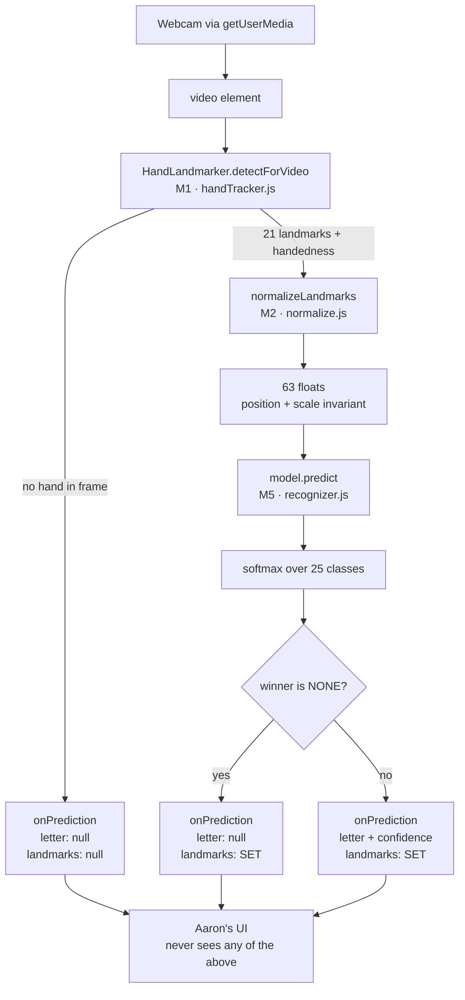
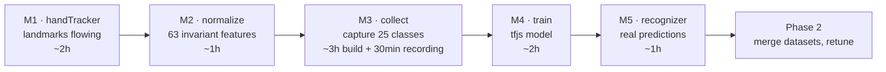
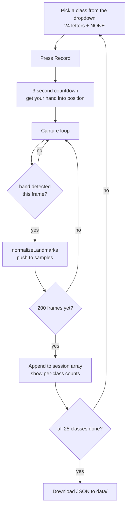

# Phase 1 — Mert's build guide

The vision half, M1 → M5. Read [SOW.md](SOW.md) first for the contract; this is the
how-to-actually-do-it companion.

**Rule that makes this work:** you never touch `App.jsx`, `index.html`, `index.css`, or
`components/`. Your tools live at `/collect.html` and `/train.html`, which are their own
Vite entries. Aaron is building against the mock the entire time you're doing this, so
nothing you do here blocks him and nothing he does blocks you.

---

## The pipeline you're building



The three exits on the right are the whole contract. Everything left of `onPrediction` is
yours to change freely; the three shapes coming out of it are not.

## Build order and what each step unblocks



It's a strict chain — each step needs the one before it. That's why the mock exists: it
breaks the chain for Aaron so only *you* are serialized, not both of you.

If you get stuck for more than 30 minutes on any of these, the unblocked work is M3's UI
shell (dropdown, countdown, download button all work fine against fake features) or M4's
data-loading half. Build those while the blocker sits.

---

## M1 · Landmarks flowing

**File:** `src/lib/handTracker.js` (spec is already in the file header)
**Done when:** you can log 21 stable `{x, y, z}` points and a handedness string at ~30fps.

### What you're building

```js
createHandTracker({ onFrame }) -> Promise<{ attach(videoEl), stop() }>
onFrame({ landmarks, handedness })
```

Same `attach`/`stop` shape as the recognizer contract on purpose — M5 then composes this
with normalize and predict instead of rewriting the loop.

### Steps

**1. Get the landmarker created.** This is async and slow (it downloads ~35MB of wasm the
first time), so do it once at `createHandTracker` time, not per frame.

```js
import { HandLandmarker, FilesetResolver } from "@mediapipe/tasks-vision";

const WASM_BASE = "https://cdn.jsdelivr.net/npm/@mediapipe/tasks-vision@1.0.1/wasm";
const MODEL_URL =
  "https://storage.googleapis.com/mediapipe-models/hand_landmarker/" +
  "hand_landmarker/float16/1/hand_landmarker.task";

async function createLandmarker(delegate) {
  const vision = await FilesetResolver.forVisionTasks(WASM_BASE);
  return HandLandmarker.createFromOptions(vision, {
    baseOptions: { modelAssetPath: MODEL_URL, delegate },
    runningMode: "VIDEO",
    numHands: 1,
  });
}
```

**The `1.0.1` in that URL must match `package.json`.** The JS loader and the `.wasm`
binary are a matched pair; mixing versions fails at init with an error that never says
"version mismatch". This already bit us once in the plan.

**2. GPU with a CPU fallback.** `delegate: "GPU"` fails outright on some machines, and you
will not be the one whose machine it fails on — it'll be Aaron's, or the demo laptop.

```js
let landmarker;
try {
  landmarker = await createLandmarker("GPU");
} catch (err) {
  console.warn("GPU delegate failed, falling back to CPU:", err);
  landmarker = await createLandmarker("CPU");
}
```

**3. The rAF loop, with the timestamp guard.** `detectForVideo` throws if the timestamp
isn't *strictly* increasing, and `requestAnimationFrame` can absolutely fire twice against
the same video frame on a high-refresh display.

```js
let rafId = null;
let lastTimestamp = -1;
let video = null;

function loop() {
  rafId = requestAnimationFrame(loop);
  if (!video || video.readyState < 2) return;      // HAVE_CURRENT_DATA

  const now = performance.now();
  if (now <= lastTimestamp) return;                 // the guard
  lastTimestamp = now;

  const result = landmarker.detectForVideo(video, now);
  const landmarks = result.landmarks?.[0] ?? null;
  const handedness = result.handedness?.[0]?.[0]?.categoryName ?? null;
  onFrame({ landmarks, handedness });
}
```

Note `result.handedness`, **not** `result.handednesses`. Both exist in v1; the plural one
is deprecated and most tutorials online still use it.

Also note `handedness[0][0].categoryName` — it's an array of arrays of `Category` objects,
one outer entry per detected hand. It's easy to end up logging `[object Object]` here and
wonder why your mirroring logic never fires.

**4. Return the handle.**

```js
return {
  attach(videoEl) { video = videoEl; if (rafId === null) loop(); },
  stop() {
    if (rafId !== null) cancelAnimationFrame(rafId);
    rafId = null;
    landmarker.close();
  },
};
```

`close()` matters — StrictMode double-mounts in dev, and leaking landmarkers will
eventually exhaust GPU memory and make you think the model is at fault.

### Verify before moving on

- Log `landmarks.length` — must be exactly 21, every frame a hand is visible.
- Wave your hand out of frame: `landmarks` goes `null`, no exception thrown.
- Flip to your left hand: `handedness` changes. **Check this specifically** — MediaPipe
  reports handedness from the *camera's* point of view, and since your preview is mirrored
  it may read the opposite of what you expect. Whatever it says, M2 has to be consistent
  with it, so establish the truth now with a deliberate test rather than assuming.
- Leave it running 5 minutes. Frame rate should stay flat. If it degrades, something is
  leaking per frame.

---

## M2 · Normalize

**File:** `src/lib/normalize.js`
**Done when:** the 63 numbers barely move as you walk toward and away from the camera.

### The algorithm, in this exact order

```
1. if handedness is "Left", negate every x        -> both hands map to one space
2. subtract landmark 0 (wrist) from all 21 points -> position invariant
3. divide everything by max(abs(all coords))      -> scale invariant
4. flatten to [x0,y0,z0, x1,y1,z1, ...]           -> length 63
```

**Order is not negotiable.** Mirroring after centering gives a different vector than
mirroring before, because the wrist's own x moves under the mirror. Pick this order,
record all your data with it, and never change it — if you change normalization after
recording, every JSON file you have becomes garbage.

### Why each step

- **Step 1** halves your data collection. Without it you'd need 200 frames per letter *per
  hand*. With it, one model covers both.
- **Step 2** means it doesn't matter where in frame your hand is.
- **Step 3** means it doesn't matter how far from the camera you are. Dividing by the
  single largest absolute value across the whole set (not per-axis) preserves the hand's
  proportions; per-axis scaling would distort the shape and make M and N look even more
  alike than they already do.

### Verify before moving on

Write a scratch page or just log to console:

- Hold one letter, walk toward and away from the camera. The 63 numbers should barely
  move. **If they scale with distance, step 3 is wrong.**
- Hold one letter, move your hand to each corner of the frame. Numbers should barely move.
  If they track your position, step 2 is wrong.
- Hold the same letter with your left hand, then your right. The two vectors should be
  close. If they're mirror images, step 1 is wrong or is running in the wrong order.
- `features.length === 63`, always. No `NaN`. A `NaN` here poisons training silently —
  `model.fit` will run happily and produce a model that predicts one class forever.

That last one is worth an actual assertion in the code, not just a look.

---

## M3 · Collect mode

**File:** `src/pages/CollectPage.jsx`, reachable at `localhost:5173/collect.html`
**Done when:** you have a JSON file in `data/` with 25 classes × ~200 samples.

Styling is irrelevant. Aaron is not looking at this page. Function only.

### Capture session flow



### What the page needs

1. **A dropdown of `CLASSES`** — import it from `contract.js`, don't retype it. `NONE`
   must be in the list; it's a class, not an absence.
2. **A 3-second countdown** before capture starts, so you have time to get your hand into
   position and settled.
3. **A capture loop that collects exactly 200 frames where a hand was detected.** Skip
   frames with no hand rather than counting them — otherwise a fumbled start gives you 40
   real samples and 160 nulls.
4. **A live counter** (`137 / 200`) so you know how long to keep moving.
5. **Per-class counts for the whole session**, always visible. This is what catches "I
   thought I did R but I did it twice and never did Q."
6. **A download button** producing exactly:

```json
{
  "version": 1,
  "recordedBy": "mert",
  "samples": [{ "label": "A", "features": [63 numbers] }]
}
```

`mergeDatasets()` in `lib/train.js` already reads this shape and validates it.

### How to actually record — this is the part that decides your accuracy

**Rotate and shift your hand slowly through the entire 200-frame capture.** Tilt it
forward and back, rotate maybe 20° each way, move it nearer and farther, drift it around
the frame. You're not trying to hold a perfect example — you're trying to cover the space
of things that letter looks like in real use.

If you hold perfectly still you get 200 nearly identical rows, a validation accuracy of
0.99, and a model that fails the moment anyone holds their hand slightly differently. This
is the single highest-leverage thing in the whole project and it costs you nothing but
remembering to do it.

**For `NONE`, record garbage on purpose:** hand at rest in your lap, hand half out of
frame, mid-transition shapes between letters, scratching your face, reaching for the
keyboard. Give it 300–400 frames rather than 200 — it has to cover far more variety than
any single letter, and it's the class that stops the app hallucinating letters while you
move. Skipping or under-recording `NONE` is the most common way this kind of project ends
up feeling broken.

**Budget:** 200 frames at 30fps is ~7 seconds of capture, plus the countdown and picking
the next letter. Call it 25 seconds per class, so ~12 minutes of recording if nothing goes
wrong, 25–30 minutes realistically. Do it in one sitting under consistent lighting.

**File size:** ~315,000 floats ≈ 4–7MB of JSON. Commit it. Git is the right place for
this — it's how you and Aaron merge datasets in Phase 2 and how neither of you loses a
recording session.

### Verify before moving on

- Open the JSON. Spot-check that `samples.length` ≈ 5000 and every `features` array is 63
  long.
- Check per-class counts are all roughly equal (except `NONE`, deliberately higher).
- Confirm no `NaN` made it in: `JSON.stringify` turns `NaN` into `null`, so grep the file
  for `null` inside `features`. Finding any means M2 has a hole.

---

## M4 · Train

**File:** `src/pages/TrainPage.jsx` + `src/lib/train.js`, at `localhost:5173/train.html`
**Done when:** `public/model/` holds a model with honest validation accuracy.

### Steps

**1. Load and merge.** File input accepting multiple `.json` files →
`mergeDatasets(files)` → `{ xs, ys, counts }`. Already written; it validates labels and
feature lengths and throws with the recorder's name if something's off.

**2. Show `counts` before training.** A class with 12 samples because a capture run got
interrupted is invisible in the accuracy number and blindingly obvious in the counts.

**3. Build and fit.**

```js
import * as tf from "@tensorflow/tfjs";
import { CLASSES, NUM_FEATURES } from "../lib/contract";

const model = tf.sequential({
  layers: [
    tf.layers.dense({ inputShape: [NUM_FEATURES], units: 64, activation: "relu" }),
    tf.layers.dropout({ rate: 0.2 }),
    tf.layers.dense({ units: CLASSES.length, activation: "softmax" }),
  ],
});
model.compile({
  optimizer: "adam",
  loss: "categoricalCrossentropy",
  metrics: ["accuracy"],
});

await model.fit(tf.tensor2d(xs), tf.tensor2d(ys), {
  epochs: 60,
  validationSplit: 0.2,
  shuffle: true,
  callbacks: {
    onEpochEnd: (epoch, logs) =>
      setLog((l) => [...l, { epoch, acc: logs.acc, valAcc: logs.val_acc }]),
  },
});
```

**4. Save.** `await model.save("downloads://asl-model")` gives you `asl-model.json` and
`asl-model.weights.bin`. Move both into `public/model/`.

### Reading the numbers honestly

**Watch `val_acc`, not `acc`.** If `val_acc` hits 0.99 on your first try, be suspicious
rather than pleased — it almost always means step-3-of-M3 didn't happen and you captured
200 near-identical frames per class. The model memorized your exact hand position and will
collapse on Aaron's hand.

Realistic target for one person's data: **0.90–0.96 val_acc**. Below 0.85, something is
wrong with normalization rather than the model. Above 0.98 from a single recording
session, distrust it.

`shuffle: true` with `validationSplit` shuffles *before* splitting, but consecutive frames
from one capture run are near-duplicates, so some of your validation set will be
near-copies of training rows regardless. This inflates `val_acc` no matter what you do —
which is exactly why the real test is M5 on a live hand, and the real-real test is a third
person's hand in Phase 2.

**Worth building if you have 20 spare minutes:** a confusion matrix over the validation
set. It'll tell you specifically that M/N/S/T are eating each other, which turns "the model
is 91%" into "record more M and N," which is actionable.

### Verify before moving on

- `val_acc` in the 0.90–0.96 band and still climbing or flat at the end, not diverging
  from `acc` (a widening gap = overfitting; more dropout or more data).
- Both files landed in `public/model/` and `npm run build` still passes.
- The label order you trained with is `CLASSES` from `contract.js`, unmodified.

---

## M5 · Real recognizer

**File:** `src/lib/recognizer.js`
**Done when:** Aaron pulls `main`, changes nothing, and sees real letters.

### The composition

```js
import * as tf from "@tensorflow/tfjs";
import { CLASSES, NONE_LABEL } from "./contract";
import { createHandTracker } from "./handTracker";
import { normalizeLandmarks } from "./normalize";
import { createMockRecognizer } from "./mockRecognizer";

export async function createRecognizer({ onPrediction }) {
  if (import.meta.env.VITE_USE_MOCK === "1") {
    return createMockRecognizer({ onPrediction });
  }

  const model = await tf.loadLayersModel("/model/asl-model.json");

  // Warm up so the first real frame isn't a 300ms stall.
  tf.tidy(() => model.predict(tf.zeros([1, 63])));

  const tracker = await createHandTracker({
    onFrame({ landmarks, handedness }) {
      if (!landmarks) {
        onPrediction({ letter: null, confidence: 0, landmarks: null });
        return;
      }

      const features = normalizeLandmarks(landmarks, handedness);
      const scores = tf.tidy(() => model.predict(tf.tensor2d([features])).dataSync());

      let best = 0;
      for (let i = 1; i < scores.length; i++) if (scores[i] > scores[best]) best = i;
      const label = CLASSES[best];

      onPrediction({
        letter: label === NONE_LABEL ? null : label,
        confidence: scores[best],
        landmarks,               // RAW and UNMIRRORED — contract rule 2
      });
    },
  });

  return {
    attach: tracker.attach,
    stop: () => { tracker.stop(); model.dispose(); },
  };
}
```

### Four things that will bite you here

1. **`tf.tidy` is not optional.** You're predicting 30 times a second. Every `tensor2d` and
   every `predict` output is a GPU allocation that tfjs will *not* garbage-collect for you.
   Without `tidy` the tab climbs memory steadily and dies after a few minutes, and it looks
   exactly like a performance problem rather than a leak. Sanity check with
   `tf.memory().numTensors` — it should be flat while running, not climbing.
2. **`attach()` may never be called.** Contract rule 4: if the camera fails, Aaron creates
   the recognizer and never attaches. `stop()` must not throw in that state.
3. **Return `landmarks` raw and unmirrored** — the ones you got from MediaPipe, untouched.
   Not the normalized 63, not flipped for display. Aaron's overlay does its own flip.
4. **Never emit the string `"NONE"`.** It maps to `letter: null`. Aaron's UI has no concept
   of it and shouldn't.

`dataSync()` blocks the main thread. At this model size that's microseconds and fine; if
you ever see frame stutter, `await scores.data()` is the async version, but it changes
`onFrame` into an async callback and you'll need to guard against overlapping frames.

### Verify — this is the real acceptance test

- Set `VITE_USE_MOCK=1` in `.env.local`, confirm you get the mock. Unset it, confirm you
  get the model. That flag is your demo-day insurance.
- Fingerspell your own name. Watch for letters that never fire and letters that fire when
  they shouldn't.
- **Hold your hand still on one letter for 10 seconds.** The prediction should be steady,
  not flickering between two classes. Flicker here is a data problem, not a threshold
  problem — Aaron's debounce can hide it but shouldn't have to.
- **Move between letters.** During transitions the winner should be `NONE` → you emit
  `null`. If real letters fire mid-transition, `NONE` is under-recorded. Go back to M3 and
  record more of it; this is the most common thing to get wrong.
- Run for 5 minutes and watch `tf.memory().numTensors`.
- Pull Aaron's branch and run his UI against your recognizer without editing a single line
  of his code. If you have to touch his files, the contract was violated somewhere.

---

## Milestone checklist

- [ ] **M1** — 21 landmarks logging at 30fps, handedness verified against a deliberate
      left/right test, no exceptions when the hand leaves frame, GPU→CPU fallback in place,
      flat frame rate over 5 minutes
- [ ] **M2** — 63 features, no `NaN`, stable across distance / position / hand
- [ ] **M3** — collect page working, all 25 classes recorded with rotation, `NONE`
      over-recorded, JSON committed to `data/`
- [ ] **M4** — `val_acc` 0.90–0.96, per-class counts even, model in `public/model/`
- [ ] **M5** — real letters in Aaron's UI with zero changes to his files, tensor count
      flat, mock still reachable behind the env flag

## Troubleshooting

| Symptom | Almost always |
| --- | --- |
| MediaPipe fails at init, unhelpful error | wasm CDN version ≠ `package.json` version |
| `detectForVideo` throws about timestamps | missing the strictly-increasing guard |
| Everything predicts one class | `NaN` in the features — M2 has a hole |
| `val_acc` 0.99, useless live | you held still while recording; re-record with rotation |
| Confident letters while moving between signs | `NONE` under-recorded |
| M/N/S/T confused | expected; record more of just those four |
| Tab slows then dies after a few minutes | missing `tf.tidy` in the predict path |
| Skeleton drawn backwards in Aaron's UI | you mirrored landmarks before emitting; send them raw |
| Two predictions per frame in dev | StrictMode double-mount; `stop()` isn't cleaning up |
